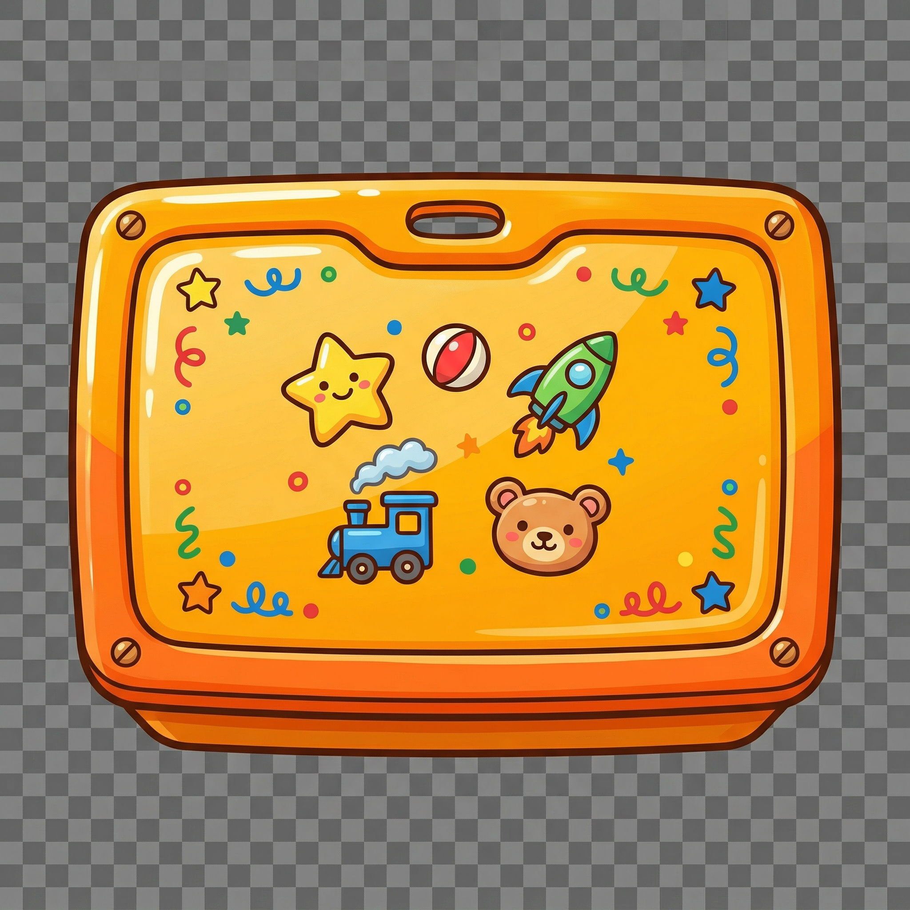
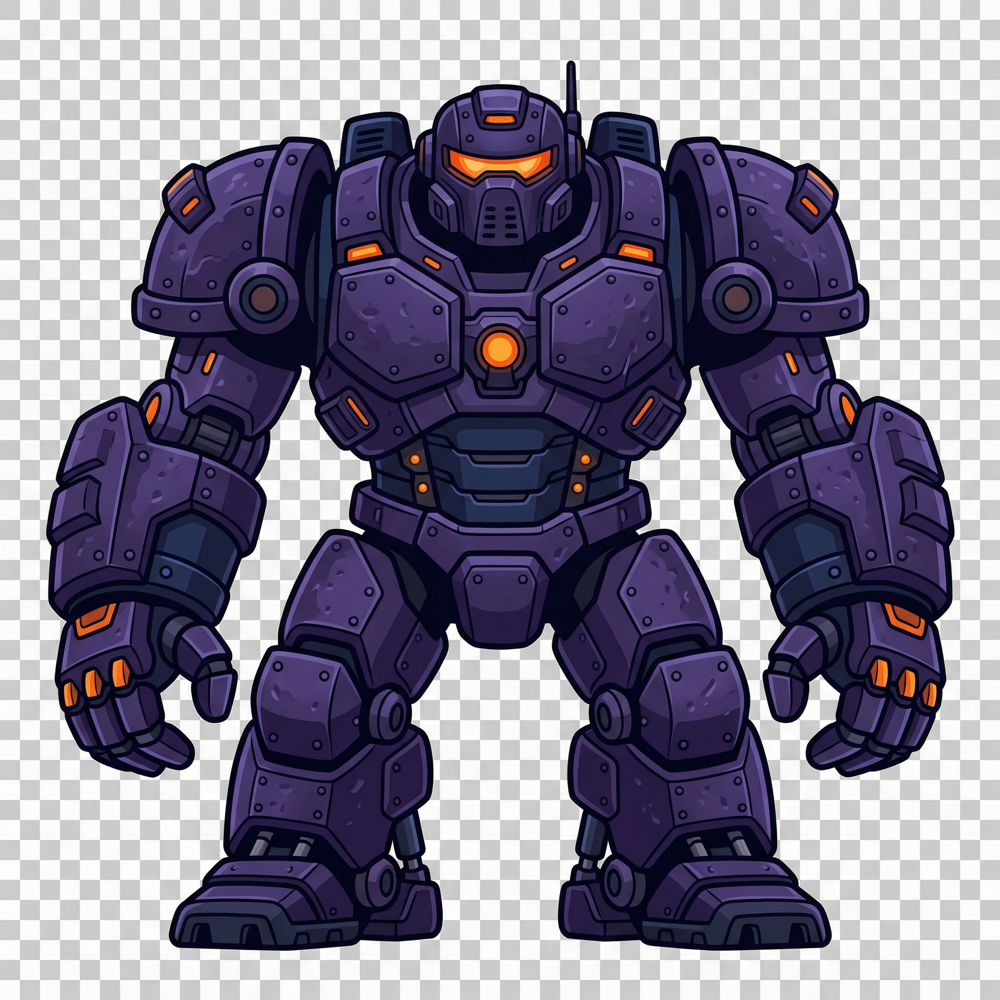
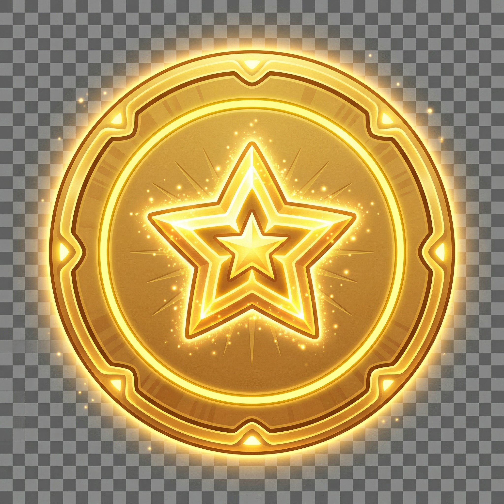

<p align="center">
  <h1 align="center">玩具星港：滚滚滚</h1>
  <p align="center">
    Toy Star Harbor: Roll Roll
    <br />
    A 3D puzzle game where boxes roll, faces change, and every roll is a decision.
  </p>
</p>

<p align="center">
  <a href="LICENSE"></a>
  <a href="https://godotengine.org"></a>
</p>

---

## About the Game

**玩具星港：滚滚滚** is a 3D level puzzle game set in a toy warehouse floating in space.

The core mechanic: push a Rolling Utility Box one grid cell, and its top face changes. The same box that opens doors can defeat enemies or press buttons — depending on which face lands up. Route planning *is* the puzzle.

**Core pillars:**
1. Rolling IS the puzzle — every roll changes state, not just position
2. One box, multiple uses — every box must serve at least two roles per level
3. Cute outside, hardcore inside — charming visuals with deterministic, learnable rules

---

## Art Assets

Generated textures for the game:

### Box Faces
| Normal | Impact | Heavy | Energy |
|--------|--------|-------|--------|
|  |  |  |  |

### Environment
| Floor | Wall |
|-------|------|
|  |  |

### Player Character


### Enemies
| Normal Enemy | Heavy Enemy |
|--------------|-------------|
|  |  |

### Environment Objects
| Door | Floor Button | Energy Socket | Ramp Tile | Conveyor Tile | Goal Pad | Rotating Platform |
|------|--------------|---------------|-----------|---------------|----------|------------------|
|  |  |  |  |  |  |  |

---

## Quick Start

1. Open the project in **Godot 4.6**
2. Open `src/core/main/main.tscn` as the main scene
3. Play!

## Project Structure

```
src/
  core/
    autoload/       # AudioManager, GameState singletons
    grid/           # GridCoord, GridMotor (movement + collision)
    main/           # Main scene and level orchestration
    shared/         # DesignTokens, shared constants
  gameplay/
    boxes/          # RollingBox with face-orientation state machine
    enemies/        # NormalEnemy, HeavyEnemy
    interactables/  # Buttons, doors, energy sockets, terrain tiles
    player/          # Player controller
    terrain/         # WallBlock, floor tiles
  levels/          # LevelRoot and tutorial levels
  ui/              # HUD and menus

assets/
  art/             # 3D models, textures
  audio/           # Music stems, SFX

design/
  gdd/            # Game design documents (systems, levels)
  levels/          # Level concepts and teaching arcs

production/
  milestones/      # Milestone definitions
  sprints/         # Sprint plans and tracking

tests/
  unit/           # Grid and terrain unit tests
```

## Design Documents

Key GDDs in `design/gdd/systems/`:
- `rolling-utility-box.md` — Box face states, rolling rules
- `terrain-system.md` — Ramp, conveyor, rotating platform tiles
- `enemy-system.md` — Enemy defeat conditions
- `ui-hud-system.md` — HUD and star rating display
- `scoring-system.md` — Move count vs par star rating

## Status

Currently in **Sprint 3** (Milestone 02: Vertical Slice). Core mechanics and terrain systems are implemented.

## License

MIT License. See [LICENSE](LICENSE).
